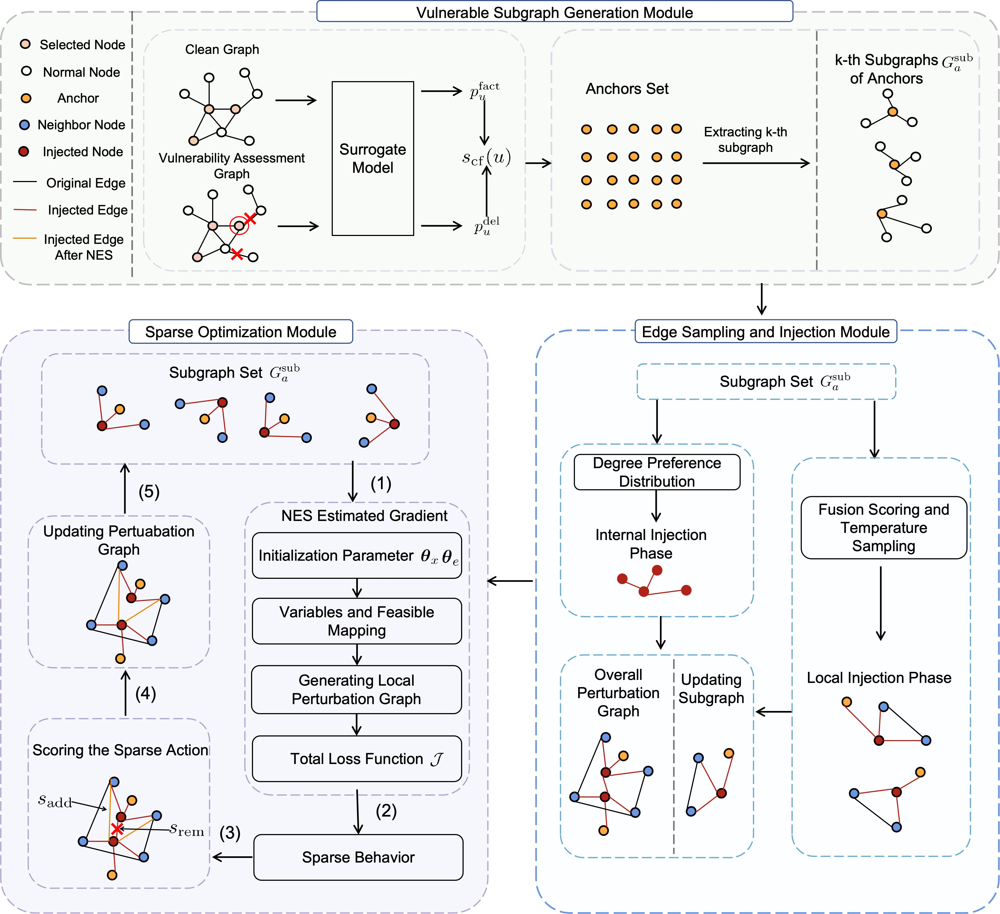
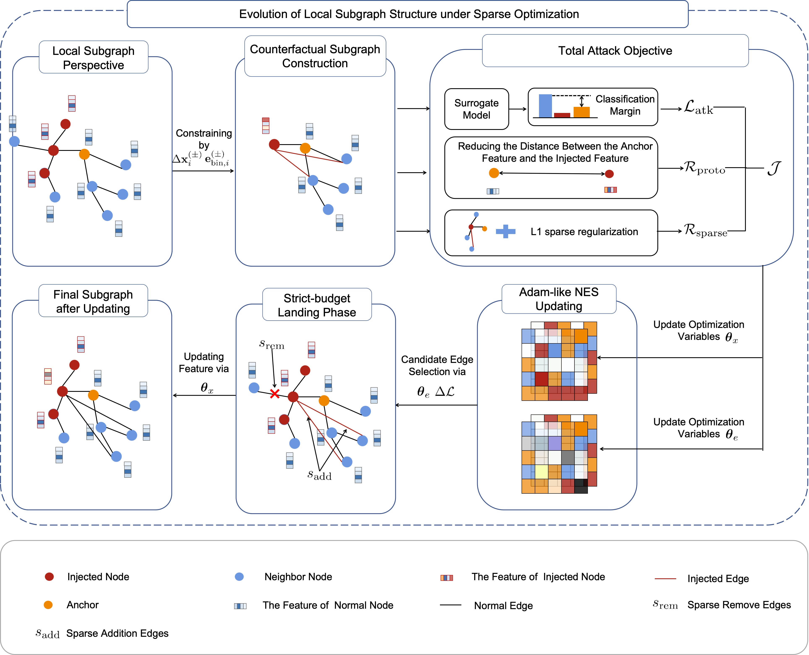

# CaVNI: Causal Vulnerability-Aware Sparse Node Injection Attacks against Black-Box Graph Neural Networks

This repository provides the implementation of **CaVNI**, a new framework for sparse node injection against black-box GNNs.  
CaVNI focuses on (i) Vulnerable Subgraph Generation Module, (ii) Edge Sampling and Injection Module, and (iii) Sparse Optimization Module.

<p align="center">  <p align="center"><em>Fig. 3: Overall framework of CaVNI. The framework consists of three modules: vulnerable subgraph generation, edge sampling and injection, and sparse optimization. In particular, steps (1)–(5) in the sparse optimization module depict the iterative workflow of each optimization cycle.</em></p>

## Highlights
- **Black-box setting**: only queryable forward outputs are required.
- **Vulnerable subgraph generation**: localizes a small set of vulnerable anchors and extracts k-hop subgraphs to reduce the search space.
- **Sparse injection under strict budgets**: Given anchor-centered subgraphs, sparse connections for each injected node are determined under a per-node degree budget
- **Sparse optimization**: jointly refines injected edges/features with **NES** under strict budgets.
- **Strict-budget landing**: discretized/Top-k landing ensures the final injected structure obeys the given edge budget.

<p align="center">  <p align="center"><em>Fig. 4: This figure illustrates the attack region from a local-subgraph perspective. It then constructs counterfactual local subgraphs by adding candidate edges between injected nodes and selected candidates. Finally, guided by the optimized hyperparameters, the procedure iteratively adds or removes edges to refine the local structure in a sparse and effective manner.</em></p>

---

## Requirements

### Tested Environment
- OS: Ubuntu (GPU environment)
- CUDA: 11.8 (cu118)
- PyTorch: **2.1.2+cu118**
- DGL: **1.1.3+cu118**
- PyTorch Geometric: **2.6.1** (with matching CUDA wheels)
  
### Python Dependency File
- pip install -r requirements.txt

---

## Run the demo

  ```
  python -u run_CaVNI.py   --dataset cora --victim gcn --gpu 0   --steps 40 --bb_queries 24  --nes_hard_topk --nes_edge_budget 8  --lam_class 1.2 --lam_l1  0.001
  ```
## Run the ablation file
  ```
  bash ablation_grid_by_ds.sh
  ```
